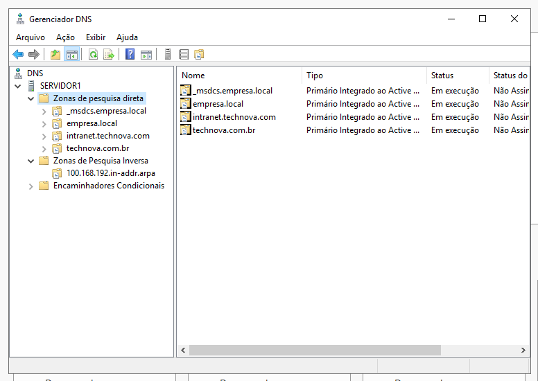
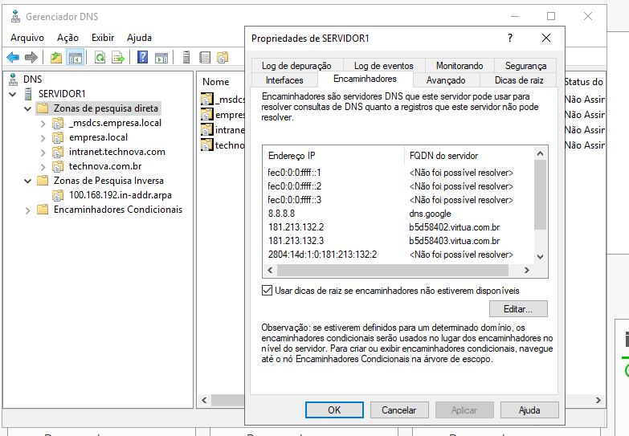

# 🌐 Resolução de Nomes e Infraestrutura de Core Services (DNS)

## 📌 Objetivo do Projeto
Demonstrar a implementação, auditoria e administração de zonas de resolução de nomes utilizando o Windows Server 2019. O projeto evidencia o gerenciamento de zonas integradas ao Active Directory (AD-Integrated Zones), resolução reversa de sub-redes locais, gerenciamento de múltiplos namespaces de negócios (`technova.com.br`) e políticas de encaminhamento de consultas externas (Forwarders) para otimização de tráfego de internet.

---

## 🏗️ Estrutura das Zonas e Configurações Coletadas
*   **Servidor DNS Principal:** `SERVIDOR1` (`192.168.100.10`)
*   **Escopo de Resolução Interna:** Zonas locais corporativas e zonas de infraestrutura do Active Directory.
*   **Resolução Externa:** Encaminhadores públicos configurados para encaminhamento recursivo (Ex: Google DNS `8.8.8.8`).

---

## 🔍 Diagnóstico e Evidências do Ambiente

### 1. Mapeamento de Zonas de Pesquisa (Direta e Inversa)
**O que foi feito:** Criação e manutenção de Zonas de Pesquisa Direta para resolução de nomes em IPs corporativos e provisionamento da Zona de Pesquisa Inversa baseada na sub-rede de infraestrutura do laboratório (`192.168.100.0/24`). A maioria das zonas críticas está integrada ao Active Directory, o que garante replicação segura e multimestre entre Controladores de Domínio.

*   **Comando de validação utilizado no PowerShell do Servidor:**
    ```powershell
    Get-DnsServerZone | Select-Object ZoneName, ZoneType, IsDsIntegrated | Format-Table
    ```

    **Saída real do comando:**
    ```text
    ZoneName                 ZoneType IsDsIntegrated
    --------                 -------- --------------
    _msdcs.empresa.local     Primary            True
    0.in-addr.arpa           Primary           False
    100.168.192.in-addr.arpa Primary            True
    127.in-addr.arpa         Primary           False
    255.in-addr.arpa         Primary           False
    empresa.local            Primary            True
    intranet.technova.com    Primary            True
    technova.com.br          Primary            True
    TrustAnchors             Primary            True
    ```

*   **Evidência Visual:**
    <br>
    <p align="center">
      
    </p>
    
    *Nota: A listagem comprova o suporte a cenários corporativos complexos com múltiplos domínios locais ativos e a zona inversa funcional integrada ao diretório.*

---

### 2. Configuração de Encaminhadores (DNS Forwarders)
**O que foi feito:** Configuração de políticas de resolução recursiva no servidor de DNS local. Sempre que uma máquina cliente requisita a resolução de um nome externo na internet (como `github.com`), o servidor consulta os encaminhadores configurados para acelerar a resposta e reduzir o consumo de banda através do cache local.

*   **Comando de validação utilizado no PowerShell do Servidor:**
    ```powershell
    Get-DnsServerForwarder
    ```

    **Saída real do comando:**
    ```text
    UseRootHint        : True
    Timeout(s)         : 3
    EnableReordering   : True
    IPAddress          : {fec0:0:0:ffff::1, fec0:0:0:ffff::2, fec0:0:0:ffff::3, 8.8.8.8...}
    ReorderedIPAddress : {8.8.8.8, 181.213.132.2, 181.213.132.3, 2804:14d:1:0:181:213:132:2...}
    ```

*   **Evidência Visual:**
    <br>
    <p align="center">
      
    </p>
    
    *Nota: A evidência técnica confirma que o servidor está utilizando Root Hints e regras de ordenação dinâmica, tendo o IP público 8.8.8.8 como um dos resolvedores principais de internet.*
